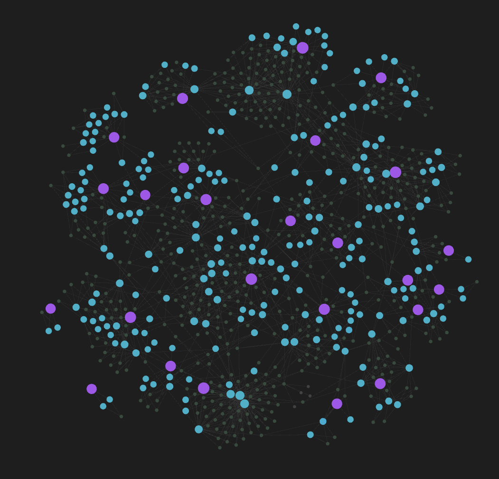

# gemini-to-knowledge-graph

> Turns your Gemini chat history into a linked Obsidian knowledge graph — auto-generated MOCs (Category → Topic → Conversation) built from a curated taxonomy, not just exported notes.



You've had hundreds of conversations with AI — working through a technical problem at 2am, learning a new topic from scratch, thinking out loud about a decision. Each one held something worth keeping, and each one is now buried in an endless scroll, essentially unfindable a month later.

gemini-to-knowledge-graph turns that scroll into a second brain. It pulls your Gemini chat history out of the walled garden, classifies each conversation against a topic taxonomy using an LLM (local or cloud — see [Local or cloud?](#local-or-cloud)), and builds an Obsidian vault where everything you've explored is actually connected — category leads to topic leads to conversation — so months of scattered thinking becomes one browsable graph.

**Just want your chats in Obsidian?** Stage 1 (extract) + Stage 3 (vault) run
without classification — ``python -m extractors.gemini`` then
``python obsidian_layout.py`` writes every conversation as a markdown note in
`Obsidian_Vault/Conversations/` with the full chat text, frontmatter metadata,
and source tags. No LLM needed. Run ``classify_chats.py`` later when you're
ready to add the category/topic graph hierarchy.

It's a three-stage pipeline that extracts your Gemini conversations, classifies them against a curated taxonomy, and builds an Obsidian vault with a hierarchical graph structure.

```
Extract ──> Classify ──> Vault
```

### Shared utilities (`common.py`)

All three stages draw on a shared library, `common.py`, so config-loading,
hashing, and database logic never drift between scripts:

- **`load_config()`** — loads `config/config.json` with clear error messages
  for every missing or malformed key (`api.*`, `limits.*`, `node_sizing.*`,
  vault paths — each validated only by the stage that needs it)
- **`load_topics()`** — loads `config/topics.json` and returns lookup maps
  for normalizing/canonicalizing LLM output against the taxonomy
- **`chat_fingerprint(chat)`** — SHA-256 hash of a chat's title and turn
  text, used to detect when a chat's content has changed
- **`canonicalize_topic(name)`** — folds casing/whitespace variants of a
  known topic back to one canonical spelling
- **`dedup_case_insensitive(items)`** — deduplicates a list of strings
  case-insensitively, preserving the first occurrence's casing
- **`iter_chats(chats_dir)`** — generator that yields `(filepath, chat_dict)`
  for every `*.json` file in `chats/`, used by all downstream stages
- **`load_existing_vault_state(convos_dir)`** — scans an existing vault's
  `Conversations/` folder and returns a dict of `{cid: (notename, signature)}`
  for resume/rewrite-in-place detection
- **`yaml_str(value)`** — safely quotes a string for YAML frontmatter
- **`get_db_connection(cfg)` / `init_db(conn)`** — open (and create on first
  use) the SQLite database backing classifications, the `chats` metadata
  table, and `ignored_conversations`
- **`upsert_classification` / `load_all_classifications` / `delete_classifications`**
  — insert/replace, bulk-load, and delete rows in the `classifications` table
- **`add_ignored_conversations` / `load_ignored_conversations` / `remove_ignored_conversations`**
  — manage the `ignored_conversations` table: conversation IDs the extractor
  should skip on future runs (populated by `prune_chats.py`)
- **`upsert_chat` / `get_chat_row` / `get_chat_rows`** — insert/replace,
  single-lookup, and batched-lookup helpers for the `chats` table. The
  extractor writes here after every download; `prune_chats.py` deletes from
  here when pruning.
- **`sync_chats_to_db(conn, chats_dir)`** — scans `chats/*.json` using
  `os.scandir` + mtime pre-filtering, inserts or updates the `chats` table
  for any file whose `chat_fingerprint()` has changed. Called at the start
  of `classify_chats.py`, `obsidian_layout.py`, and `prune_chats.py`'s
  normal prune flow, so every stage's view of the DB is current before it acts.
- **`find_orphaned_cids` / `exceeds_prune_safety_threshold`**
  — shared helpers for `prune_chats.py`: find chat IDs with no corresponding
  file on disk, and safety-check the deletion ratio against a configurable
  threshold

### Extractor package (`extractors/`)

Each chat source has its own module under `extractors/`, sharing a common
write pattern from `extractors/base.py`:

- **`extractors/base.py`** — provides `upsert_chat_and_file()`, the shared
  "write JSON + set mtime + upsert DB" helper used by every extractor
- **`extractors/gemini.py`** — Gemini Web extraction logic, run via
  ``python -m extractors.gemini``

---

## Local or cloud?

Both work — the classifier just needs an endpoint that speaks the
OpenAI-style `/v1/chat/completions` format. That covers local servers
([llama.cpp](https://github.com/ggml-org/llama.cpp)'s `llama-server` or
[Ollama](https://ollama.com)) as well as cloud providers (OpenAI, Groq,
Together, OpenRouter, Mistral, DeepSeek, Azure OpenAI) and Claude, via
Anthropic's [OpenAI-compatible endpoint](https://docs.claude.com/en/api/openai-sdk)
(documented by Anthropic as a testing/evaluation interface, not their
recommended production API).

**Privacy note:** this tool sends the full text of your conversations to
whichever endpoint you configure — potentially years of personal questions
and private details. If that matters more than raw quality/speed, local is
the safer default; nothing leaves your machine. Cloud is a fully supported
option if you don't have the hardware for a decent local model.

This project was built and tested against **Gemma 4** locally, but any
OpenAI-compatible model works — just make sure `api.context_window_tokens`
matches what you're actually serving (see [Configuring your LLM](#configuring-your-llm)).

---

## Pipeline Overview

### Stage 1: Extract (`python -m extractors.gemini`)

Downloads your full Gemini chat history from gemini.google.com using session
cookies. Resumable — only fetches new chats on subsequent runs, skips
conversations on the ignore list (see [Reviewing extracted chats](#reviewing-extracted-chats-optional)),
and reconciles pin status changes automatically.

- **Output:** `chats/*.json` — one file per conversation, with on-disk mtime
  set to the conversation's own timestamp so file explorers sort by real date
- **Requires:** `GEMINI_1PSID` and `GEMINI_1PSIDTS` in `.env` (from browser cookies)

### Stage 2: Classify (`classify_chats.py`)

Reads each conversation and sends it to your configured LLM (any
OpenAI-compatible API) for single-pass classification: **1–2 Categories**
and **2–5 Topics** per chat. Resumable and safely interruptible.

Features a two-pass response parser — first tries strict label matching
(`Category:` / `Topic:` / `Summary:`), then falls back to positional recovery
when labels are missing (common with smaller models). Topic names mistakenly
output as categories are automatically mapped back to their parent category.

- **Output:** `chat_topics.db` (SQLite) — per-conversation classification
  records with status tracking, error detail, and content hashing for
  incremental re-runs
- **Requires:** A running LLM server (default `http://localhost:8080`)
- **Taxonomy:** `config/topics.json` — 25 categories, 206 seed topics (the LLM can coin new ones)

### Stage 3: Vault (`obsidian_layout.py`)

Generates an Obsidian vault with a strict three-tier hierarchy:

```
Category Hub (e.g. "Physics & Astronomy")
    └── Topic Note (e.g. "Gravitational Acceleration")
            └── Conversation Note (the full chat)
```

Conversations never link directly to categories — the graph is always
Category → Topic → Conversation.

- **Output:** `Obsidian_Vault/` — ready to open in Obsidian
- **Features:** YAML frontmatter (`created`, `updated`, source, turn_count, word_count, categories, topics, `note_signature`, `node_size`, etc.), tags including source tags (`source/gemini_web`), graph-view color groups, summary excerpts, `[!quote]` callouts with configurable user/assistant labels
- **Smart staleness detection:** Uses `note_signature()` — a combined hash of chat content *and* classification outcome — so a chat whose text is unchanged but whose classification just went from `error` to `ok` still gets its note rewritten
- **Link placeholder resolution:** Gemini's `[Product Name](_link)` patterns are rewritten to real browser search links (configurable via `obsidian.search_url`)
- **File timestamps:** Each conversation note's on-disk mtime is set to the conversation's own timestamp for correct filesystem ordering
- **Deduplication:** Category and topic names are deduplicated case-insensitively at every stage.
- **Uncategorized fallback:** If every topic a chat was assigned collides with a category name (and gets filtered to avoid an ambiguous wikilink), the chat falls back to a generic `Uncategorized (<Category>)` topic instead of losing its topic links entirely.

---

## JSON contract

Stages 2 and 3 read a standard chat shape from `chats/*.json`. The extractor
writes this format; downstream stages don't care where it came from:

```json
{
  "conversation_id": "gemini_c_0b2b2434ededef14",
  "source": "gemini_web",
  "title": "Planning a Weekend Hiking Trip",
  "created_at": "2026-06-19T18:13:52+00:00",
  "updated_at": "2026-06-19T18:13:52+00:00",
  "turn_count": 2,
  "turns": [
    { "turn_number": 1, "role": "user", "timestamp": "...", "text": "..." },
    { "turn_number": 2, "role": "model", "timestamp": "...", "text": "..." }
  ]
}
```

`role` can be any string — the vault builder gives `user` a quote-callout
block and `assistant`/`model` a labeled response block; anything else is
rendered as plain text.

---

## Quick Start

### 1. Prerequisites

- Python 3.10+
- An LLM reachable via an OpenAI-compatible `/v1/chat/completions` endpoint —
  either a local server ([llama.cpp](https://github.com/ggml-org/llama.cpp)'s
  `llama-server` or [Ollama](https://ollama.com)) or a cloud provider (OpenAI,
  Anthropic's Claude via its [OpenAI-compatible endpoint](https://docs.claude.com/en/api/openai-sdk),
  Groq, OpenRouter, etc.) — see [Local or cloud?](#local-or-cloud) for the tradeoffs.
- Obsidian itself, if you want to open the resulting vault (the pipeline
  creates the vault folder for you)
- Two **optional** Obsidian community plugins — the pipeline works fine
  without them, but you'll get default-sized, alphabetically-sorted notes
  instead of what this README describes, with no error to tell you why.
  Both are searchable by name in Obsidian's Community Plugins browser:
  - [**Custom Node Size**](https://github.com/jackvonhouse/custom-node-size) — makes the graph view respect the `node_size`
    value in each note's frontmatter (see [Node sizing](#node-sizing-node_sizing))
  - [**Custom Sort**](https://github.com/SebastianMC/obsidian-custom-sort) —
    makes the `Conversations` folder respect `sortspec.md` (see
    [Sorting conversations](#sorting-conversations))

### 2. Setup

```bash
# Clone the repo
git clone <url>
cd gemini-to-knowledge-graph

# Create virtual environment
python -m venv .venv
.venv\Scripts\activate       # Windows (cmd.exe)
.venv\Scripts\Activate.ps1   # Windows (PowerShell)
source .venv/bin/activate    # macOS/Linux

# Install dependencies
pip install -r requirements.txt

# Configure environment
cp .env.example .env

# Configure the pipeline
cp config/config.example.json config/config.json
cp config/topics.example.json config/topics.json
```

Edit `.env` with your Gemini cookies and (optionally) a cloud API key:

```env
GEMINI_1PSID="your-__Secure-1PSID-cookie"
GEMINI_1PSIDTS="your-__Secure-1PSIDTS-cookie"
LLM_API_KEY=""               # leave empty for local servers
```

Edit `config/config.json` — see the next sections for what actually matters.

### 3. Run the Pipeline

```bash
# Step 1 — Extract chats from Gemini
python -m extractors.gemini
```

> **Optional but recommended:** before classifying, skim `chats/*.json` and
> delete anything you don't want kept — throwaway messages, or anything
> you'd rather not have summarized or (on a cloud LLM) sent off-machine.
> Run `prune_chats.py --prune` afterwards — the deletion will stick even
> though nothing was classified yet. See [Reviewing extracted chats](#reviewing-extracted-chats-optional).

```bash
# Step 2 — Classify with your LLM
python classify_chats.py

# Step 3 — Build the Obsidian vault
python obsidian_layout.py
```

Then open `Obsidian_Vault/` in Obsidian and explore the graph view.

### Reviewing extracted chats (optional)

`chats/*.json` is meant to be human-reviewable — delete any file you don't
want classified or vaulted, then run `prune_chats.py --prune` to make the
deletion stick. Everything works regardless of order:

- **File timestamps match conversation time.** The extractor sets each
  file's on-disk mtime to the conversation's own timestamp, so newest-first
  ordering in Windows Explorer or VS Code's file explorer reflects true
  chronological order within and across runs.

- **Deleting a chat before it's ever classified still works.** The `chats`
  metadata table tracks every conversation ID the extractor has ever
  downloaded. When you delete a chat file and run `prune_chats.py`, it
  sees the orphaned ID in the DB, removes its metadata, and adds it to
  the ignore list — regardless of whether it was ever classified. The
  conversation won't reappear on subsequent extractions.

  The recommended workflow is:

  ```
  extract → review & delete → prune_chats.py --prune → classify → vault
  ```

  But you can also prune mid-pipeline any time you like — the classification
  and vault stages call `sync_chats_to_db()` automatically, so the DB is
  always current when prune runs.

- **Prune is always a dry-run by default** (without `--prune`). Add
  `--confirm-large-delete` if the number of orphans exceeds 30% of known
  chats — this prevents accidentally wiping your entire DB from a
  misconfigured path.

---

## Configuring your LLM

The `api` block in `config/config.json`:

```json
"api": {
  "url": "http://localhost:8080/v1/chat/completions",
  "model": "gemma4",
  "temperature": 0.05,
  "max_output_tokens": 350,
  "timeout": 300,
  "context_window_tokens": 24000,
  "safety_margin_tokens": 500
}
```

| Key | Meaning |
|---|---|
| `url` | Your LLM server's chat-completions endpoint. |
| `model` | Model name/tag as your server expects it. |
| `temperature` | Keep low — classification is a structured-output task, not creative writing. |
| `max_output_tokens` | Cap on reply length; the prompt asks for a fixed format so this can stay small. |
| `timeout` | Seconds to wait for a call before retrying. |
| `context_window_tokens` | **Set this to the context length your server is actually serving with right now** — the setting most likely to bite you. |
| `safety_margin_tokens` | Buffer subtracted from the input budget for token-counting estimation error. |

### Why `context_window_tokens` matters

The classifier reserves tokens for the system prompt, `max_output_tokens`,
and `safety_margin_tokens` — whatever's left is the per-chat input budget.
Long chats aren't split into multiple calls: if a chat doesn't fit, the
pipeline keeps the start and end and drops the middle.

**Set this to what your server actually serves, not the model's advertised
max** — a spec sheet saying "128K context" is irrelevant if your server
caps it lower to save VRAM/RAM:

- **llama.cpp:** check the `-c` / `--ctx-size` flag you launched with
- **Ollama:** check `num_ctx` — often defaults smaller than the model's max
- **Cloud APIs:** use the documented context window for the model in `api.model`

Too high → requests overflow and error out. Too low → more truncation than
necessary.

The classifier distills each conversation into a ~350-token summary with
category and topic labels — it doesn't need the full transcript to be
accurate, so chat-splitting (sending a long conversation across multiple
LLM calls and merging the results) is deliberately avoided in favor of
simplicity and speed. The full conversation text is preserved untouched in
the vault note regardless of any truncation during classification.

### Turn off reasoning / "thinking" mode for speed

If your local model has a reasoning or "thinking" mode (a `/think` toggle,
an `enable_thinking` flag, a reasoning-effort setting, etc.), turn it off
for classification. This is a fixed, structured extraction task — it gets
no benefit from chain-of-thought, and leaving reasoning on can turn a
~2–3 second classification into a ~10 second one, which adds up fast across
hundreds of conversations. Check your server's docs for the relevant
flag (llama.cpp, Ollama, and most reasoning-capable models expose one).

### Customizing the prompt (`config/prompts/classifier.md`)

You're free to edit the wording, tone, or guidance in `classifier.md` — the
instructions above `{categories_list}` and the framing around it are yours
to adjust. **Don't change the required response shape**, though:

```
Category: <category>[, <second category>]
Topic: <topic>, <topic>, <topic>, <topic>, <topic>
Summary: <1-2 sentence summary>
```

This three-line format is a deliberately compressed, low-token output —
`classify_chats.py`'s `parse_response()` parses it by label prefix (with a
positional fallback for unlabeled replies), and a JSON or free-form
response would either cost far more output tokens per chat or break the
parser outright. Add whatever extra context or rules you need in the
prompt body; just leave the `Category:`/`Topic:`/`Summary:` line structure
exactly as documented in the template.

---

## Configuring the vault graph

By default, the vault is generated at `Obsidian_Vault/` in the project
root. To rename or relocate it, change `paths.vault_dir` in
`config/config.json` — the pipeline creates the folder for you either way.

The `display_names`, `obsidian`, and `node_sizing` blocks in `config/config.json` control how
the vault's graph view looks. All are validated when `obsidian_layout.py`
starts — a missing or malformed key fails fast with a message telling you
exactly what to fix.

### Display names (`display_names`)

Optionally label user and assistant roles in conversation notes instead of
the raw `user`/`model` text:

```json
"display_names": {
  "user": "You",
  "assistant": "Gemini"
}
```

Leave both empty to use the raw role strings.

### Node sizing (`node_sizing`)

Obsidian sizes notes by raw link count, which makes popular topics look
much larger than categories. This block overrides that with non-overlapping
size bands per tier, so categories are always larger than topics, topics
always larger than conversations:

```json
"node_sizing": {
  "conversation": 8,
  "topic": { "floor": 25, "ceiling": 60 },
  "category": { "floor": 72, "ceiling": 100 }
}
```

| Key | Meaning |
|---|---|
| `conversation` | Fixed size for every conversation note. |
| `topic.floor` / `topic.ceiling` | Sqrt-compressed range for topic nodes. |
| `category.floor` / `category.ceiling` | Sqrt-compressed range for category nodes. |

These values are written into each note's frontmatter as `node_size` and
recomputed every run. You'll need a community plugin such as **Custom Node
Size** for Obsidian to respect them.

### Graph colors (`obsidian.colors`)

| Tag | Key | Default rgb |
|---|---|---|
| `#type/conversation` | `conversation` | `65280` |
| `#type/topic` | `topic` | `43947` |
| `#type/category` | `category` | `16711680` |
| `#status/unclassified` | `unclassified` | `8421504` |

These are the built-in fallbacks `obsidian_layout.py` uses when
`obsidian.colors` doesn't set a given key — `"rgb"` is a 24-bit packed
integer (e.g. `65280` = pure green), `"a"` is alpha (0–1). Override any of
them in `config.json` (the example `config.json` in this repo already does,
with its own color scheme). Other `obsidian` settings (`repelStrength`,
`linkDistance`, etc.) are passed through to Obsidian's graph config directly.

### Link placeholder resolution (`obsidian.search_url`)

Gemini often emits markdown links as `[Product Name](_link)` without real
URLs. The vault builder rewrites these to browser search links using the
configured `search_url`. Defaults to DuckDuckGo (`https://duckduckgo.com/?q=`)
— override it in `config.json` to use Google or another search engine.

### Sorting conversations

The vault includes a `sortspec.md` in `Conversations/` for the
[obsidian-custom-sort](https://github.com/SebastianMC/obsidian-custom-sort)
plugin, sorting by `updated` (newest first). Topic notes list their
conversations newest-first the same way.

> **Graph view:** `sortspec.md` is a config file, not a real note. Exclude
> it via **Settings → Files & Links → Excluded files**, or right-click it
> in the graph and choose "Exclude this file from graph."

---

## Flags & resuming

Every stage is resumable — interrupt and re-run any script and it picks up
where it left off.

**`classify_chats.py`**
- `python classify_chats.py` — classify everything not yet classified
- `python classify_chats.py 20` — classify only the next 20 (useful for testing your prompt/taxonomy)
- `python classify_chats.py --retry` — re-attempt only chats that previously errored

**Resume intelligence:** `classify_chats.py` skips chats whose
`chat_fingerprint()` hasn't changed since last classified. `obsidian_layout.py`
goes further, comparing a `note_signature()` — content hash *plus*
classification outcome — so a chat whose text is unchanged but whose
classification just went from `error` to `ok` (or from unclassified to
classified) still gets its note rewritten, instead of silently staying stale.

**`obsidian_layout.py`**
- `python obsidian_layout.py` — incremental: writes only new or changed conversation notes, refreshes all topic/category hubs
- `python obsidian_layout.py --force` — wipes and regenerates everything. **Use this after editing `config/topics.json`** (renaming/merging topics) — incremental mode never deletes stale topic/category notes on its own.

**`python -m extractors.gemini`**
- No flags — incremental based on the last-seen pagination timestamp, and always skips conversation IDs in the ignore list (populated by `prune_chats.py`). Reconciles pin status changes automatically.

**`prune_chats.py`**
- `python prune_chats.py` — scan `chats/` for orphaned conversations (files no longer on disk but still tracked in the DB). **Dry-run by default** — prints what would be deleted without changing anything.
- `python prune_chats.py --prune` — execute the deletion after reviewing the dry-run output. For each orphan the cascade is: delete classifications → delete `chats` row → add to ignore list → delete vault note.
- `python prune_chats.py --prune --confirm-large-delete` — bypass the 30% safety gate if orphans exceed that threshold (e.g. after a bulk cleanup).
- `python prune_chats.py --list-ignored` — show all currently ignored conversation IDs with their reason and timestamp.
- `python prune_chats.py --unignore <cid> [<cid> ...]` — remove conversation IDs from the ignore list. The chats will be re-downloaded on the next extraction **only if** a new message has pushed the chat past the current pagination checkpoint; otherwise you'll need to reset `last_timestamp_regular` to `0` in `checkpoint/extraction_state_gemini.json` to force a full re-scan. Their old classification and vault note are **not** restored — those must be regenerated by re-running the full pipeline.

---

## Testing

A pytest suite in `tests/` covers `common.py`'s helpers, the classifier's
parsing/truncation/resume logic, the vault builder's staleness detection and
pure helper functions (`make_safe_filename`, `scaled_node_size`,
`normalize_category`, `opening_prompt`, `yaml_tag_block`, `format_date`),
`prune_chats.py`'s orphan-detection logic, and the extractor package's
pin-status reconciliation and raw-turn parsing.

```bash
pip install -r requirements-dev.txt
pytest -v
```

Run the suite before and after any changes.

---

## Linting

This project is linted with [ruff](https://docs.astral.sh/ruff/):

```bash
pip install ruff
ruff check .
```

CI runs the same check in GitHub-annotation format:

```yaml
ruff check --output-format=github
```

---

## Troubleshooting

The scripts try to fail with an actionable message rather than a bare
traceback. Common ones:

| Symptom | Fix |
|---|---|
| `Missing config file: config/config.json` | `cp config/config.example.json config/config.json`, then edit it |
| `config/config.json is missing paths.{...}` / `api.{...}` / `limits.{...}` | Compare against `config/config.example.json` and add the missing key |
| `config/config.json is missing or has malformed node_sizing...` | Add the full `node_sizing` block — see [Node sizing](#node-sizing-node_sizing) |
| `GEMINI_1PSID and/or GEMINI_1PSIDTS not found in .env` | Re-copy the cookies from gemini.google.com's DevTools → Application → Cookies |
| `Connection failed` / cookies expired | Re-login to gemini.google.com and update `.env` |
| `API not reachable` (Stage 2) | Your LLM server isn't running, or `api.url` is wrong |
| A chat repeatedly fails classification | Run `classify_chats.py --retry` after fixing your LLM config. If it still fails, check the model's output format against the `Category:`/`Topic:`/`Summary:` template, or try a lower `temperature`. |
| Renamed/merged a topic in `topics.json` but old notes remain | Run `python obsidian_layout.py --force` |
| A chat I deleted keeps reappearing after a later extraction | Delete the chat file and run `prune_chats.py --prune` to add it to the ignore list. The extractor will skip it from then on. See [Reviewing extracted chats](#reviewing-extracted-chats-optional). |
| I accidentally pruned a conversation and want it back | Run `prune_chats.py --unignore <cid>` to remove it from the ignore list. Re-download depends on whether a new message has bumped the chat past the current checkpoint — if not, reset `last_timestamp_regular` to `0` in `checkpoint/extraction_state_gemini.json` to force a full re-scan. Re-run classify and vault afterwards — the old classification and vault note are **not** restored. |

---

## Project Structure

```
gemini-to-knowledge-graph/
├── common.py                       # Shared helpers used by all stages
├── extractors/                     # Extraction modules
│   ├── __init__.py
│   ├── base.py                     # Shared upsert_chat_and_file() helper
│   └── gemini.py                   # Gemini Web extraction
├── classify_chats.py               # Stage 2 — LLM classification
├── obsidian_layout.py              # Stage 3 — Vault builder
├── prune_chats.py                  # Orphan cleanup from DB + vault
├── config/
│   ├── config.example.json         # Template — copy to config.json
│   ├── config.json                 # Your local config (gitignored)
│   ├── topics.example.json         # Template — copy to topics.json
│   ├── topics.json                 # Category/topic taxonomy (gitignored)
│   └── prompts/
│       └── classifier.md           # LLM prompt template
├── checkpoint/
│   └── extraction_state_gemini.json  # Extraction progress checkpoint
├── chats/                          # Extracted conversations (gitignored)
├── docs/
│   ├── DESIGN_NOTES.md             # Why the pipeline is shaped this way
│   └── images/
│       └── graph-preview.png
├── Obsidian_Vault/                 # Generated Obsidian vault (gitignored)
│   ├── .obsidian/                  # Editor config, plugins (graph.json, custom-sort)
│   ├── Concepts/
│   │   ├── Categories/            # MOC notes per category
│   │   └── Topics/                # MOC notes per topic
│   ├── Conversations/             # Individual conversation notes
│   └── sortspec.md
├── tests/
│   ├── conftest.py
│   ├── test_common.py
│   ├── test_classify_chats.py
│   ├── test_obsidian_layout.py
│   ├── test_prune_chats.py
│   └── extractors/
│       ├── test_base.py
│       └── test_gemini.py
├── chat_topics.db                 # SQLite: classifications + ignore list (gitignored)
├── .env.example
├── .gitignore
├── pytest.ini
├── requirements.txt
├── requirements-dev.txt
└── README.md
```

---

## Why it's built this way

The reasoning behind the three-stage split, the seed-taxonomy classifier,
the strict category → topic → conversation hierarchy, and the state/safety
mechanisms (ignore list, prune cascade, safety threshold) is written up
separately in [`docs/DESIGN_NOTES.md`](docs/DESIGN_NOTES.md) — including a
few approaches (mid-point relationship notes, cluster hubs, dual-mode
vaults) that were considered and deliberately not built.

---

## Roadmap

- **Multi-source extractors** — The pipeline architecture is modular; adding
  ChatGPT or Claude support means writing a new module under `extractors/`
  that writes the same JSON contract to `chats/`. The classify and vault
  stages already don't care where a chat came from.
- **Chat review/pruning workflow** — a proper keyword-filter / manual-review
  / restore UI on top of the DB-backed tracking
- **Taxonomy promotion workflow** — periodically surface topics the
  classifier has coined that aren't yet in the seed taxonomy, for review;
  once confirmed genuinely new (not a near-duplicate), promote them into
  `config/topics.json` as permanent canonical entries

---

## License

MIT