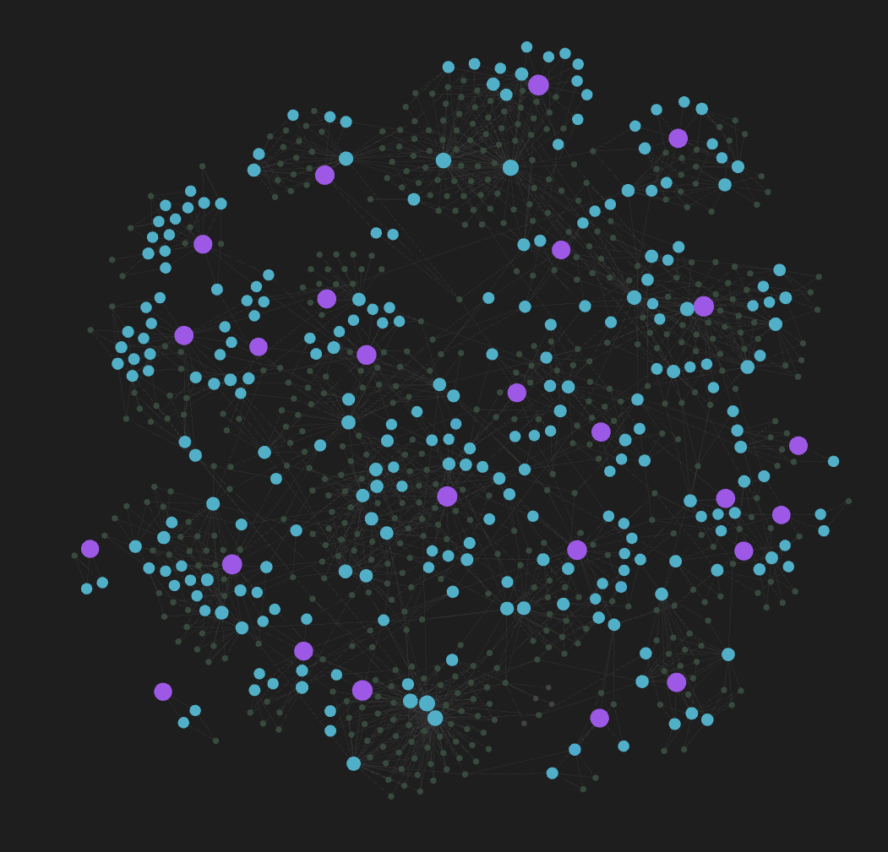

# gemini-to-knowledge-graph

> Turn scattered Gemini conversations into a searchable second brain — a linked Obsidian vault with auto-generated Category → Topic → Conversation MOCs, built from a curated taxonomy instead of flat exported notes.

<p align="center">
  
</p>

You've had hundreds of conversations with AI — technical debugging at 2am, learning something from scratch, thinking out loud about a decision. Each one held something worth keeping, and each one is now buried in an endless scroll, effectively unfindable a month later.

**gemini-to-knowledge-graph is a Gemini chat exporter** that pulls your conversation history out of Gemini's walled garden, classifies each conversation against a topic taxonomy using an LLM (local or cloud), and builds an Obsidian vault where everything you've explored is actually connected — category leads to topic leads to conversation.

```
Extract ──> [Review] ──> [Prune] ──> [Mask] ──> Classify ──> Vault (Obsidian_Vault/)
                                                 │
                                                 └─> [Embed ──> Similarity Vault]
             optional stages, in the order shown
```

**Just want your chats in Obsidian, no classification?** Run Stage 1 + Stage 3 only:

```bash
python -m extractors.gemini
python obsidian_layout.py
```

Every conversation lands as a markdown note with full text and frontmatter — no LLM required. Run `classify_chats.py` later to add the category/topic hierarchy.

---

## Highlights

- **Cookie-based extraction** — no OAuth app registration, no API quota; paste your browser session cookies and go
- **Fully resumable pipeline** — every stage (extract, classify, vault) picks up exactly where it left off; interrupt any script safely
- **SQLite-backed state** — classifications, chat metadata, embeddings, similarity links, and the ignore list live in one queryable DB, synced incrementally via mtime + content-hash pre-filtering
- **Smart staleness detection** — catches not just text changes but classification-outcome transitions too (unclassified → classified, error → ok), so nothing silently goes stale
- **Safe, reversible pruning** — orphan detection with a full cascade delete across DB, JSON files, and vaults with a safety threshold that blocks accidental mass-deletion
- **Editable review manifest with sensitive-info flagging and masking** — a plain-CSV pass before classification lets you skim titles, mark chats `KEEP`/`DEL`, and get automatic regex + keyword flags, plus optional in-place redaction of matched content for chats you want to keep
- **Human-reviewable at every stage** — chats land as plain JSON you can open, edit, or delete before anything is sent to an LLM or written to the vault
- **Local-first, cloud-optional** — works with any OpenAI-compatible endpoint, so your history never has to leave your machine unless you choose otherwise
- **Strict three-tier graph** — Category → Topic → Conversation, enforced consistently, so the graph view stays legible instead of turning into a hairball
- **Optional semantic similarity graph** — embed conversation summaries and precompute top-K similarity links for an alternative, flat `Similarity_Vault/`
- **Source-agnostic architecture** — the extractor is a swappable module; adding ChatGPT or Claude history later won't touch downstream stages

---

## Local or cloud?

The classifier and embedding stages need endpoints that speak OpenAI-style `/v1/chat/completions` and `/v1/embeddings` formats — local servers (llama.cpp, Ollama) or cloud providers (OpenAI, Groq, Together, OpenRouter, Claude via its OpenAI-compatible endpoint, etc.) all work.

**Privacy note:** this tool sends full conversation text to whichever endpoint you configure. If that matters more than raw speed/quality, run local — nothing leaves your machine. See [docs/CONFIGURATION.md](docs/CONFIGURATION.md#local-or-cloud) for provider notes and context-window setup.

---

## Quick Start

> **Prefer a guided walkthrough?** Attach [`ASSISTANT_INSTRUCTIONS.md`](ASSISTANT_INSTRUCTIONS.md) as context to any AI coding assistant (Copilot, Claude, ChatGPT, etc.) and tell it what you want to do. It'll check what's already been set up and guide you step by step — no need to read through all the docs first.

### 1. Prerequisites

- Python 3.10+
- An LLM reachable via an OpenAI-compatible endpoint (see above)
- Obsidian, if you want to open the resulting vault
- Optional: [Custom Node Size](https://github.com/jackvonhouse/custom-node-size) and [Custom Sort](https://github.com/SebastianMC/obsidian-custom-sort) community plugins — the pipeline works without them, but graph sizing/sorting falls back to Obsidian's defaults

### 2. Setup

```bash
git clone <url>
cd gemini-to-knowledge-graph

python -m venv .venv
source .venv/bin/activate    # macOS/Linux
.venv\Scripts\Activate.ps1   # Windows (PowerShell)

pip install -r requirements.txt

cp .env.example .env
cp config/config.example.json config/config.json
cp config/topics.example.json config/topics.json
```

Edit `.env` with your Gemini cookies (`GEMINI_1PSID`, `GEMINI_1PSIDTS` — from gemini.google.com's DevTools → Application → Cookies) and, optionally, a cloud `LLM_API_KEY`.

Optionally, if you want automatic sensitive-info flagging during review:

```bash
cp config/sensitive_patterns.example.json config/sensitive_patterns.json
```

then edit it with your own regex patterns and personal keywords (name, address, etc.) — see [docs/CONFIGURATION.md](docs/CONFIGURATION.md#sensitive-pattern-scanning-configsensitive_patternsjson).

### 3. Run the pipeline

```bash
python -m extractors.gemini     # Stage 1 — extract
python review_chats.py          # Optional — review before classifying, see below
python review_chats.py --mask-sensitive --apply   # Optional — redact flagged info in chats you're keeping
python classify_chats.py        # Stage 2 — classify
python obsidian_layout.py       # Stage 3 — build vault
```

Then open `Obsidian_Vault/` in Obsidian and explore the graph view.

> Want to review chats — skim titles, flag sensitive content, mark chats for deletion, or redact sensitive info in chats you'd rather keep? The review stage can be run at any time, but it's recommended before anything is classified or vaulted. See [docs/CLI.md](docs/CLI.md#reviewing-extracted-chats).

### Optional: Similarity-based graph (Similarity Vault)

Prefer connecting chats by semantic similarity instead of taxonomy categories? After running `classify_chats.py`:

```bash
cp config/embedding.example.json config/embedding.json
python embed_chats.py        # Stage 4a — embed summaries & compute top-K links
python embedding_layout.py   # Stage 4b — build Similarity_Vault/
```

Open `Similarity_Vault/` in Obsidian to see conversations connected directly via `Related Conversations` links. See [docs/CONFIGURATION.md](docs/CONFIGURATION.md#embedding-configuration-configembeddingjson) for details.

---

## Troubleshooting

| Symptom | Fix |
|---|---|
| `Missing config file: config/config.json` | `cp config/config.example.json config/config.json`, then edit it |
| `GEMINI_1PSID and/or GEMINI_1PSIDTS not found in .env` | Re-copy the cookies from gemini.google.com's DevTools → Application → Cookies |
| `Connection failed` / cookies expired | Re-login to gemini.google.com and update `.env` |
| `API not reachable` (Stage 2) | Your LLM server isn't running, or `api.url` is wrong |

More edge cases (topic collisions, stuck classifications, un-pruning, review manifest issues, embedding setup) are covered in [docs/CLI.md](docs/CLI.md#troubleshooting).

---

## Further reading

- [docs/CONFIGURATION.md](docs/CONFIGURATION.md) — full `api` / `node_sizing` / `obsidian` / embedding config reference, context-window tuning, prompt customization, sensitive-pattern scanning setup
- [docs/CLI.md](docs/CLI.md) — every flag for every stage (including embedding & similarity vault), resume behavior, the review and pruning workflow
- [docs/ARCHITECTURE.md](docs/ARCHITECTURE.md) — `common.py` reference, the JSON contract, project structure, similarity graph architecture
- [docs/DESIGN_NOTES.md](docs/DESIGN_NOTES.md) — why the pipeline is shaped this way, and what was deliberately not built

---

## Roadmap

- **Multi-source extractors** — architecture is modular; ChatGPT/Claude support means a new module under `extractors/` writing the same JSON contract
- **Taxonomy promotion workflow** — periodically surface classifier-coined topics for review and promotion into `config/topics.json`

---

## License

MIT